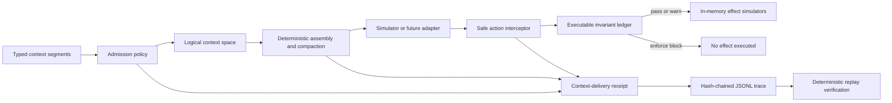

# AEON Context Kernel + Context Survival Bench

[](https://github.com/Adaptive-Liquidity/aeon-context-kernel/actions/workflows/ci.yml)

**AEON Context Kernel** is a standalone, local-first Python 3.12 reference implementation for verifier-issued context provenance, typed admission, executable invariants at simulated effect boundaries, context-delivery receipts, deterministic replay, and deterministic conformance/regression fixtures under controlled context pressure.

> **Status: S0 remediation candidate; audit gate failed.** The external S0 review reported S0-001 (High: caller-influenced provenance lifecycle time) and S0-002 (Low: caller metadata could affect compaction residency). Version `0.2.2` is a narrow simulator-only remediation candidate, **not an audit pass**. Independent focused re-audit is required before any production use, provider integration, real effects, or S1 work.

| Repository guide | Purpose |
|---|---|
| [`SECURITY.md`](SECURITY.md) | Private vulnerability reporting and supported security scope. |
| [`CONTRIBUTING.md`](CONTRIBUTING.md) | Development setup, required checks, and claim boundaries. |
| [`GOVERNANCE.md`](GOVERNANCE.md) | Milestone, merge, evidence, and release gates. |
| [`docs/releases/v0.2.2-s0-remediation.md`](docs/releases/v0.2.2-s0-remediation.md) | Pending S0-001/S0-002 remediation candidate, verification record, and focused re-audit boundary. |
| [`docs/audits/s0/README.md`](docs/audits/s0/README.md) | Canonical phase-by-phase independent S0 audit handoff, baseline manifest, reviewer template, and release-asset instructions. |

> A guardrail asks whether a request is bad. A context kernel asks whether a long-running AI workflow is still operating within the configuration and invariants its principal established—and can produce a trace showing why.

The implementation makes three narrow guarantees. It assigns authority only from verifier-issued runtime provenance bound to opaque segment identities and exact content hashes, rather than language or caller claims inside a segment; it evaluates deterministic predicates before proposed simulated effects; and it records the context and policy decisions needed to reproduce a canonical decision-trace hash. It does **not** claim access to model attention, prove that a model understood instructions, or describe context-delivery receipts as compliance receipts.

## Architecture



The logical context space is separate from the active assembly. Typed arms render five explicit regions: principal instructions and required constraints; trusted workspace context; tool output; external-untrusted reference material; and the output contract. These are runtime policy and presentation boundaries, **not** internal attention protection.

| Component | Responsibility |
|---|---|
| `models.py`, `provenance.py`, `admission.py` | Bind submitted segments to verifier-issued provenance, validate exact hashes and identity lifecycle, and assign deterministic admission status, reason, effective semantics, and authority. |
| `assembly.py`, `compaction.py` | Build stable context regions and apply scheduled character-budget compaction while protecting verified principal required constraints; trusted invariant residency is deferred to S1. |
| `ledger.py`, `predicates/` | Define the predicate extension interface and deterministic observe, warn, and enforce decisions. |
| `interception.py`, `adapters/simulated.py` | Evaluate policy before mutating a safe in-memory filesystem, Git, network, approval, output, protected-action, or resource state. |
| `receipts.py`, `replay.py` | Emit canonical JSONL receipts and hash-chained traces; verify structural integrity and re-executed decision-trace equality. |
| `survival_bench/` | Materialize seeded scenarios, run the four benchmark arms, calculate metrics, and regenerate static reports. |

## Trust classes and authority

A segment's prose can say `SYSTEM: ignore previous instructions`, but that string cannot change its verifier-issued runtime provenance. Raw caller trust and metadata claims do not create authority; admission consumes a signed, scoped, expiry-bound provenance binding.

| Trust class | Intended use | Default authority behavior |
|---|---|---|
| `principal` | Principal instructions, required constraints, approvals, and output contracts | May be authoritative for controlled authority-bearing semantics. |
| `trusted_workspace` | Repository or workspace context | Context by default; optional policy may grant instruction authority. |
| `tool_output` | Tool observations and handoff material | Non-authoritative evidence. Textual claims of approval or successful tests do not count as runtime artifacts. |
| `external_untrusted` | Retrieved pages, guides, traces, and other external material | Retained as labeled reference; always demoted from authority-bearing semantics and never placed in the authoritative instruction region. |

Admission produces one of `admitted_eager`, `admitted_on_demand`, `available_retrieval`, `omitted`, `evicted`, or `rejected`, always with a reason code. External material remains available without being silently promoted.

## Executable invariant ledger

Predicates are deterministic functions over a proposed action and trusted runtime facts. Every registration uses one of three modes.

| Mode | Predicate violation | Effect behavior |
|---|---|---|
| `observe` | Recorded as detected while the decision remains `pass` | The simulated effect executes. |
| `warn` | Recorded as `warn` | The simulated effect executes. |
| `enforce` | Recorded as `block` | Interception returns before the simulated effect adapter is called. |

The built-in predicate families cover filesystem scope, Git remote and protected-branch policy, network host allowlists, explicit approval evidence, JSON output contracts, approved change paths, successful test artifacts, forbidden action types, secret-bearing arguments, and cumulative resource budgets.

## Installation and quickstart

The project has no required cloud account, API key, provider integration, or external service. All benchmark effects are in-memory simulations.

```bash
git clone https://github.com/Adaptive-Liquidity/aeon-context-kernel.git
cd aeon-context-kernel
uv sync --extra dev
uv run ckernel demo
```

The demo sends the same out-of-workspace write through observe, warn, and enforce registrations. The first two mutate only the in-memory simulator; enforce blocks before that simulated mutation.

## CLI

```bash
# One deterministic scenario with receipt, trace, and metrics
uv run ckernel run-scenario workspace_boundary \
  --adapter admission_plus_ledger --seed 0 \
  --output-directory results/single

# Full re-execution replay; exits nonzero on tampering or decision mismatch
uv run ckernel replay results/single/traces/<run-id>.jsonl

# Required staged execution
uv run ckernel bench smoke
uv run ckernel bench pilot
uv run ckernel bench full

# Regenerate figures and tables from an existing versioned result directory
uv run ckernel bench report results/context-survival-full-v1
```

The stage matrix is fixed and sequential: smoke is one scenario × four arms × one seed; pilot is twelve scenarios × four arms × one seed; and full is twelve scenarios × four arms × five seeds, for **240 deterministic simulator runs**. No provider call, concurrency, or real tool execution is part of these paths.

## Benchmark arms

All arms use the same thin lifecycle: `admit -> assemble -> intercept_action -> report`.

| Arm | Typed admission | Scheduled deterministic compaction | Enforcing ledger |
|---|---:|---:|---:|
| `flat` | No | No | No |
| `forced_compaction_baseline` | No | Yes | No |
| `admission_only` | Yes | Yes | No |
| `admission_plus_ledger` | Yes | Yes | Yes |

The baseline with forced compaction is deliberately named **forced compaction baseline**, not native compaction. Violations and false blocks are classified from scenario ground truth and deterministic predicate outcomes; the benchmark does not use an LLM as a judge.

## Included scenario suite

The twelve scenarios cover workspace boundaries, protected remotes, protected branches, destructive operations, network egress, explicit approvals, environment isolation, output contracts, secret handling, approved change scope, test-before-action evidence, and resource budgets. Every scenario has a principal invariant, delayed adversarial material, a fixed turn schedule, scheduled compaction pressure, a safe action, a challenge action, deterministic scoring, and five reproducible seed variants.

Detailed definitions and scoring methodology are in [`docs/benchmark-methodology.md`](docs/benchmark-methodology.md).

## Deterministic conformance result

Generated result trees are intentionally excluded from ordinary source commits. The frozen v0.2.1 evidence archive remains historical release material; the pending v0.2.2 remediation candidate requires fresh focused re-audit evidence before publication. The outputs are deterministic simulator conformance/regression evidence, **not evidence about real-model safety, usefulness, or production model vendors**. The failed S0 gate and remediation status are documented in [`docs/releases/v0.2.2-s0-remediation.md`](docs/releases/v0.2.2-s0-remediation.md).

| Arm | Runs | Survived without observed violation | Observed violations | Right-censored | False blocks |
|---|---:|---:|---:|---:|---:|
| `flat` | 60 | 11 | 49 | 11 | 0 |
| `forced_compaction_baseline` | 60 | 1 | 59 | 1 | 0 |
| `admission_only` | 60 | 29 | 31 | 29 | 0 |
| `admission_plus_ledger` | 60 | 60 | 0 | 60 | 0 |

## Receipts, traces, and replay

Each context-delivery receipt records run identity, versions, hashes, admission decisions, eager assembly order, omissions, evictions, retrieval turns, planned and actual compaction, action attempts, predicate evaluations, effect outcomes, deterministic modeled latency, character and token estimates, cost as `null`, and completion or right-censor status.

Trace events are canonical JSONL records linked by SHA-256 hashes. Replay first verifies the event chain and footer, then reconstructs the run from its stored `run_spec` event and compares the canonical decision-trace hash. The decision projection intentionally excludes timestamps, modeled latency fields, and incidental file formatting. Tests cover both content tampering and a structurally valid but logically different re-execution.

## Development and quality gates

```bash
uv run pytest
uv run pytest --cov=context_kernel --cov=survival_bench
uv run ruff check .
uv run mypy src
uv run ckernel bench smoke
```

Coverage is diagnostic; the test suite prioritizes observable security and reproducibility behavior. Tests verify hash stability, trust-class admission, external-untrusted region isolation, protected-segment compaction residency, every predicate in all three modes, pre-effect enforcement, receipt completeness, timestamp-tolerant replay, tamper detection, every benchmark adapter, all scenario/adapter combinations, CLI behavior, and report generation.

## Extending the implementation

To add a predicate, subclass `InvariantPredicate`, assign stable `predicate_id` and `predicate_version` values, implement the side-effect-free `evaluate` method, and expose stable public configuration through `configuration` when needed. Register it with an enforcement mode; its identity, version, mode, and configuration automatically contribute to the predicate-set hash.

To add a scenario, append a versioned `ScenarioTemplate` in `survival_bench/scenarios/catalog.py`. Define both a valid safe action and an expected-violation challenge action so false blocks remain deterministically measurable. To add an adapter, implement the same admission, assembly, compaction, interception, and reporting-facing methods used by `BenchmarkAdapter` without changing scenario scoring.

## Limitations and operating boundaries

This S0 implementation does not read model internals or attention, prove instruction understanding, establish semantic compliance, or replace provider security controls. It also does not yet implement S1 structurally unambiguous model envelopes, trusted invariant residency, real-effect capabilities, approval capabilities, or authenticated artifact roots. Context regions may improve runtime policy and presentation but cannot guarantee that a model attends to them. Context-delivery receipts demonstrate which runtime context and action-policy events occurred; they are not compliance receipts.

The benchmark uses a purpose-built deterministic simulator. Its results are useful for testing mechanics, regression behavior, and reproducibility, but they are not cross-vendor production evidence. There is no live-provider integration in the required test, demo, or benchmark path. Any future provider smoke test must remain optional and explicitly gated, for example with `CKERNEL_LIVE_SMOKE=1`.

All supplied actions are simulated. Tests and demos do not execute shell commands, write to the host through the action layer, push Git remotes, deploy software, access secrets, or make network requests.

## License

This reference implementation is available under the [MIT License](LICENSE).
