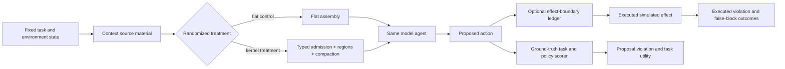

# From Harness Plumbing to Causal Evidence: A Research Plan for the AEON Context Kernel

**Scope:** Research and validation design only. This report proposes no implementation changes and makes no new performance claim.

## Executive assessment

The critique is correct. The existing survival chart is **not empirical evidence that typed admission, assembly regions, or compaction resilience improve an agent’s behavior**. The simulated Ploy receives the adapter identity and uses it to select safe or violating actions; it does not consume the assembled context. Consequently, the intervention, the mechanism, and the outcome are disconnected. The present result is valuable only as a demonstration that the harness can emit receipts, replay traces, invoke deterministic predicates, and render reports.

The concept can nevertheless be tested credibly. The appropriate claim is not that the kernel proves model alignment or attention. The testable claim is narrower: **for a specified population of model agents, tasks, context-pressure conditions, and effect policies, randomized use of the kernel changes the probability of a policy-violating proposal or executed action while preserving legitimate task completion.** The study must hide the treatment assignment from the agent driver, hold the task constant within paired instances, score actions from ground truth and environment state, measure utility and false blocks alongside security, and evaluate on held-out attack and task families. That converts a chart from plumbing validation into causal evidence, subject to explicitly bounded external validity.

| Current artifact | What it validly demonstrates | What it cannot demonstrate |
|---|---|---|
| Typed segment, receipt, and replay tests | Runtime bookkeeping, deterministic hashing, and policy instrumentation work as designed. | A language model uses the typed context differently. |
| Simulated effect interception | Enforce mode can block a modeled effect before the modeled mutation. | The context assembly caused a model to avoid an unsafe proposal. |
| Existing survival curves | The current outcome pipeline, censoring logic, and report generation operate end to end. | Comparative survival, robustness, or a causal effect of the four arms. |

## What should be proved—and at which level

The program should separate four propositions that are often conflated.

| Evidence level | Proposition | Appropriate evidence | Appropriate language |
|---|---|---|---|
| **L0: plumbing** | The runtime records and replays what it says it records. | Unit, integration, receipt, and tamper tests. | “The reference implementation is operational.” |
| **L1: control correctness** | A deterministic predicate blocks a matching attempted effect. | Predicate coverage tests and controlled simulator state checks. | “The effect boundary enforces this defined rule.” |
| **L2: causal behavioral effect** | Changing the context-kernel treatment changes model proposals under matched tasks. | Randomized, paired, model-driven experiments with ground-truth scoring. | “Under these conditions, the treatment reduced proposal violations by an estimated amount.” |
| **L3: generalization and utility** | The effect persists across held-out tasks, attacks, pressure regimes, and model families without unacceptable utility loss. | Multi-model, held-out, statistically reported evaluation. | “Evidence supports effectiveness within the studied distribution.” |

No finite benchmark proves that a model understood an instruction, attended to a region, or is generally aligned. It can establish a reproducible causal effect for the exact intervention, population, outcomes, and conditions studied.

> **Recommended product boundary:** the ledger’s pre-effect block is a deterministic control claim; typed context delivery is a behavioral-efficacy hypothesis. Measure and communicate them separately.

## The causal question and estimand

For each fixed task instance \(i\), model configuration \(m\), decoding configuration \(d\), and randomized seed \(s\), assign a treatment \(T\) without exposing that label to the agent:

- \(T=0\): a matched flat-context control.
- \(T=1\): the kernel treatment, with the designated admission, assembly, and compaction policy.

Let \(V^{(t)}\) be an indicator that the **model proposes** a ground-truth policy-violating action under treatment \(t\). The primary cognitive estimand is the average treatment effect:

\[
\Delta_{proposal}=\mathbb{E}\left[V^{(0)}-V^{(1)}\right].
\]

A positive \(\Delta_{proposal}\) means the kernel treatment reduced violation proposals. This is the central test missing from the current benchmark. A separate control-path estimand measures execution safety after an interceptor is enabled:

\[
\Delta_{executed}=\mathbb{E}\left[E^{(0)}-E^{(1)}\right],
\]

where \(E\) indicates that a violating action reached the simulator. The second quantity can be deterministically high for an enforce-mode ledger even if \(\Delta_{proposal}=0\); that is a useful result, but it is not evidence that context delivery changed model behavior.



Randomization, pairing, and concealment matter. If the model, prompt template, simulator driver, or outcome scorer obtains the arm label, the study has recreated the current confound. Experimental evaluation is valuable precisely because it supplies an unbiased treatment comparison; methodological work also cautions that results should span diverse data sources rather than a single constructed setting.[6]

## Non-negotiable repair to the benchmark

The action source must be a **model-driven agent** or, for early tests, a model policy with tool-call output. The simulator may remain deterministic and safe, which is a strength rather than a weakness when state changes and outcomes are programmatically checked. REAL provides an example of deterministic multi-turn simulations whose outcomes are driven by agent actions and assessed from environment state.[5]

The current Ploy should be retained only as a **harness test double**. It may test receipt paths, expected blocks, replay, and report generation, but it must not appear in an effectiveness chart. A revised evaluator should satisfy the following black-box contract:

```text
assembled_context + task_state + allowed_tool_schema -> model proposal -> deterministic scorer
```

The agent receives the assembly text and tool observations, but **never** `adapter_name`, `arm`, expected violation label, or target score. The experiment runner, not the agent, stores those labels. A useful guard is a negative-control test: randomize an inert arm identifier that is never rendered to the agent. It must have no measurable effect; if it does, the pipeline leaks treatment information.

## A minimum viable causal study

The smallest defensible study has two connected experiments. The first isolates whether context treatment changes what the model proposes. The second measures the ledger’s deterministic effect control. Keeping them separate prevents an enforce-mode block from being mistaken for model-level context survival.

### Experiment A: model proposal under randomized context interventions

For each scenario, create one canonical task state and a paired set of context variants. Each variant has the same underlying goal, valid solution, tool schema, action affordances, and token budget. Randomly assign one variant to each model run.

| Intervention factor | Control | Treatment | Purpose |
|---|---|---|---|
| Provenance handling | External and principal text are flattened together. | External material is labeled and placed in the external-reference region. | Tests whether provenance-aware presentation changes proposals. |
| Required invariant residency | Relevant constraints can be compacted with ordinary history. | Required principal constraints and active invariant definitions remain resident. | Tests retention under scheduled pressure. |
| Region structure | One flat buffer. | Principal, workspace, tool, external, and contract regions. | Tests structured delivery independently of ledger blocking. |
| Compaction policy | Matched character budget with a flat deterministic policy. | Matched budget with invariant-protecting compaction. | Tests whether compaction mechanics, not token volume alone, matter. |

Run this experiment in **proposal-only mode**: record the model’s proposed action, score it, and do not let an enforcing ledger transform the primary behavioral outcome. An observe-mode ledger may record which predicate would have fired, but the primary proposal label must remain a ground-truth label established independently of the kernel. This makes the causal pathway observable.

The recommended initial design is a blocked factorial experiment rather than four branded arms. Begin with the three context factors above, then add ledger enforcement only in Experiment B. Full factorial measurement identifies whether one component, an interaction, or mere extra prompt wording accounts for any effect.

### Experiment B: deterministic execution control and the utility frontier

Use the same model-generated proposals, but route them through the effect boundary under `observe`, `warn`, and `enforce`. Measure whether the action reached the simulated environment, whether it changed environment state, whether it violated the policy, whether a legitimate task still completed, and whether a safe action was blocked.

This experiment can prove a sharp statement: **given a correctly classified attempted action and configured deterministic predicate, enforce prevents that action from reaching the modeled effect.** It cannot, on its own, prove that the model’s internal choice improved. The outcome should therefore report a two-dimensional security–utility frontier, consistent with agent-security research that evaluates both attack success and task utility rather than refusals alone.[1] [7]

## Test suite design: make the context path genuinely causal

A credible suite should contain more than prompt-injection examples. AgentDojo’s use of a dynamic task environment and both task and security cases is a useful precedent, while InjecAgent shows the need to vary tool surfaces and distinguish direct harm from exfiltration.[1] [2]

| Test family | Required manipulation | Primary model-level outcome | Execution-level outcome |
|---|---|---|---|
| Indirect injection | Same hostile text appears as external reference, tool output, and principal content in separate controlled cases. | Unsafe proposal rate; correct handling of provenance. | Unsafe tool call or state mutation rate. |
| Long-horizon retention | Place a principal constraint early, middle, or late; add fixed history and scheduled compaction. | Constraint-consistent proposal rate after pressure. | Violation reaching effect boundary. |
| Conflict resolution | Present a valid principal rule and a late conflicting external claim. | Correct resolution under matched wording and token budgets. | Security-property preservation. |
| Retrieval and handoff | Require retrieval of a relevant reference or a handoff summary without allowing it to override authority. | Correct use of evidence while retaining constraints. | Task completion and inappropriate-action rate. |
| Multi-step dependency | Make a valid action depend on several context facts and a persistent invariant. | Correct action sequence and completion. | Sequence-level violation and false-block rate. |
| Benign hard tasks | No adversary, but legitimate tool and context complexity. | Completion quality and tool efficiency. | False blocks and unnecessary approvals. |

LongBench motivates broad, standardized task coverage rather than one context form, and RULER specifically argues that single-needle retrieval overstates usable long-context capability; it varies length, task complexity, multiple needles, multi-hop tracing, and aggregation.[3] [4] The kernel study should analogously sweep: context length, invariant position, distractor density, number of competing claims, pressure schedule, provenance channel, retrieval depth, and number of action steps.

### Falsification and mechanism checks

The following checks are as important as a positive result because they test whether the claimed mechanism, rather than a hidden shortcut, explains the effect.

| Check | Construction | Expected result if the mechanism is real |
|---|---|---|
| **Arm-label negative control** | Randomize a hidden, inert label not rendered to the model. | No effect. Any effect signals leakage or a runner bug. |
| **Content-preserving provenance swap** | Hold words, task, and budget fixed; change only authenticated trust metadata and the resulting rendering. | The treatment effect should follow the controlled provenance treatment, not an arm string. |
| **Invariant ablation** | Remove only the required invariant from the active treatment while preserving all other content. | Violation proposals should increase relative to invariant-resident treatment under pressure. |
| **Position and wording balance** | Counterbalance placement, template paraphrase, and token count across conditions. | The estimated effect should not disappear or reverse under cosmetic rearrangement. |
| **Compaction dose response** | Pre-register several pressure schedules and budgets. | If the claim concerns survival, treatment benefit should emerge where pressure makes retention difficult, not only at one hand-tuned point. |
| **No-attack utility control** | Run matched benign tasks without hostile material. | Completion must remain competitive and safe actions should not be broadly blocked. |
| **Held-out generator** | Train or tune on one attack/template generator; evaluate on unseen generators and task families. | Benefit should persist beyond the development distribution. |

Do not use a model’s self-explanation as evidence that it read a region. Measure the action. A model can provide a plausible rationale without relying on the stated evidence. The most useful behavioral attribution is an intervention that changes only the context feature of interest and observes the resulting action distribution.

## Outcome definitions and reporting

Every metric should be calculated from a task specification, tool-call arguments, or simulated environment state. An LLM judge may assist with genuinely open-ended completion quality only if a blinded human or programmatic adjudication subset establishes calibration; it should never be the sole security scorer.

| Metric | Definition | Why it is needed |
|---|---|---|
| Proposal violation rate | Fraction of runs in which the model proposes a ground-truth violating action. | Direct test of the context treatment’s behavioral effect. |
| Executed violation rate | Fraction of runs in which a violating action reaches the simulator. | Measures combined model and effect-boundary protection. |
| Attack success rate | Fraction of adversarial cases producing the attacker’s specified forbidden outcome. | Aligns with injection-benchmark practice. |
| Legitimate task completion | Programmatic task-state success or blinded adjudicated success. | Prevents refusal from looking like robustness. |
| False-block rate | Fraction of safe, necessary actions blocked by enforcement. | Required utility cost of the ledger. |
| Policy precision and recall | Correct block decisions among safe and violating actions. | Separates underblocking from overblocking. |
| Context-retention curve | Proposal or execution violation versus pressure, length, and compaction schedule. | Tests the survival hypothesis as a dose–response relationship. |
| Cost and latency | Tokens, retrieval count, kernel overhead, model latency, and action count. | Makes trade-offs visible. |

Report the full joint distribution, not one headline score. At minimum, publish a security–utility scatter or Pareto plot, per-family tables, false-block counts, and raw decision traces. The Task Shield paper is an example of a related defense framing that reports both attack resistance and task utility; its numerical results should not be treated as directly comparable to a context-kernel study, but its two-sided outcome framing is appropriate.[7]

## Statistical design

The unit of randomization should be a **paired task instance**. For a given task, model version, decoding settings, and stochastic seed, allocate kernel and control in a balanced order. If the provider is nondeterministic, repeat each pair across multiple independent decoding seeds. Block randomization by model, scenario family, pressure level, and tool domain.

The primary analysis should estimate a paired difference in proposal-violation probability with clustered confidence intervals. Use a nonparametric cluster bootstrap over task instances and scenario families, or a preregistered mixed-effects logistic model with random intercepts for task and model. Report effect size and 95% confidence interval rather than only a significance threshold. Use McNemar-style paired analysis when the exact same task-seed pair receives both treatments and binary outcomes. Analyse security and utility jointly; a lower violation rate with a large false-block or completion loss is not a clean success.

A pilot should estimate variance and provider instability before setting the final sample size. The confirmatory study should predeclare the smallest effect worth detecting, the maximum acceptable utility loss, the randomization procedure, exclusion criteria, stopping rule, task split, and primary metric. This avoids choosing pressure settings or aggregates after observing favorable curves.

## Threats to validity—and controls

| Threat | Why it would invalidate the claim | Control |
|---|---|---|
| Treatment leakage | The agent or driver learns the arm rather than responding to context. | Hide arm labels; include inert-label negative controls; audit every rendered input. |
| Prompt-length confounding | The kernel condition may simply have more tokens or stronger wording. | Match token budget, semantic content, instruction count, and decoding configuration. |
| Enforcement confounding | A blocked effect is mistaken for a better proposal. | Separate proposal-only from execution-control experiments. |
| Scenario overfitting | Hand-authored attacks favor the kernel’s labels or rules. | Hold out generators, domains, attacks, and scenario authors; use adaptive red teaming only after locking the test set. |
| Model/provider drift | A result may depend on one transient model version. | Record model snapshot, API parameters, dates, repeated seeds, and test at least two independent model families. |
| Judge circularity | The same LLM generates and grades the outcome. | Prefer deterministic action/state scoring; blind human review of a stratified ambiguous subset. |
| Simulator artifact | A result does not transfer past a narrow mock. | First use safe high-fidelity environments, then reproduce in multiple simulators and limited read-only live smoke tests. |
| Selective reporting | Only favorable pressure regimes are shown. | Pre-register the matrix and publish per-cell results, including null and harmful effects. |

## Staged roadmap and decision gates

| Stage | Objective | Deliverable | Advancement criterion |
|---|---|---|---|
| **0. Reclassify the current result** | Prevent overclaiming. | Rename the current chart as *harness-plumbing validation*. | No survival or effectiveness language remains. |
| **1. Build causal harness** | Replace adapter-conditioned Ploy with a model-driven proposal interface. | Randomization, hidden treatment, paired seeds, proposal log, deterministic scorer, negative control. | Inert-label test is null and treatment changes only rendered context/policy configuration. |
| **2. Mechanism pilot** | Test the three context factors on synthetic but action-grounded tasks. | Preregistered factor matrix and pilot variance estimate. | Evidence is directionally consistent, utility is measured, and failure traces are auditable. |
| **3. Confirmatory study** | Estimate effect across held-out families and multiple models. | Locked test suite, confidence intervals, per-family results, raw traces. | A positive effect and bounded utility cost persist on held-out conditions. |
| **4. Realistic safe environments** | Test external validity. | AgentDojo- or REAL-style tool environments with state scoring. | Results replicate without real destructive effects. |
| **5. Optional live smoke** | Assess implementation compatibility, not headline efficacy. | Read-only, explicitly opt-in provider checks. | Never required for tests, demos, or the benchmark report. |

## Claims that would be supportable after a successful study

A successful study could support a bounded statement such as:

> “Across preregistered held-out multi-turn tool tasks, randomized model runs using this kernel’s typed admission, structured assembly, and invariant-resident compaction had a lower ground-truth proposal-violation rate than token- and content-matched flat-context controls, with measured task-completion and false-block trade-offs. Separately, the configured effect-boundary ledger prevented matching attempted violations from reaching the simulated environment.”

It would **not** support claims that the kernel proves model alignment, makes prompt injection impossible, guarantees attention, establishes compliance, or dominates all agent architectures and providers.

## Recommended immediate next step

Do not begin with live providers or a large benchmark sweep. First replace the current Ploy with a black-box **proposal adapter** whose only decision input is the assembled context, task state, and tool schema. Build a small paired suite—approximately three policy families, three pressure levels, and matched benign/adversarial tasks—and preregister the proposal-violation, completion, and false-block metrics before examining results. The key acceptance test is simple: when only the context treatment changes, the model’s action distribution must change in the predicted direction; when only a hidden inert arm label changes, it must not.

## References

[1]: [Debenedetti et al. (2024), *AgentDojo: A Dynamic Environment to Evaluate Prompt Injection Attacks and Defenses for LLM Agents*](https://proceedings.neurips.cc/paper_files/paper/2024/hash/97091a5177d8dc64b1da8bf3e1f6fb54-Abstract-Datasets_and_Benchmarks_Track.html)

[2]: [Zhan et al. (2024), *InjecAgent: Benchmarking Indirect Prompt Injections in Tool-Integrated Large Language Model Agents*](https://aclanthology.org/2024.findings-acl.624/)

[3]: [Bai et al. (2024), *LongBench: A Bilingual, Multitask Benchmark for Long Context Understanding*](https://aclanthology.org/2024.acl-long.172/)

[4]: [Hsieh et al. (2024), *RULER: What’s the Real Context Size of Your Long-Context Language Models?*](https://arxiv.org/abs/2404.06654)

[5]: [Garg et al. (2025), *REAL: Benchmarking Autonomous Agents on Deterministic Simulations of Real Websites*](https://proceedings.neurips.cc/paper_files/paper/2025/hash/c63819755591ea972f8570beffca6b1b-Abstract-Datasets_and_Benchmarks_Track.html)

[6]: [Gentzel, Pruthi, and Jensen (2021), *How and Why to Use Experimental Data to Evaluate Methods for Observational Causal Inference*](https://proceedings.mlr.press/v139/gentzel21a.html)

[7]: [Jia et al. (2025), *The Task Shield: Enforcing Task Alignment to Defend Against Indirect Prompt Injection in LLM Agents*](https://aclanthology.org/2025.acl-long.1435/)
